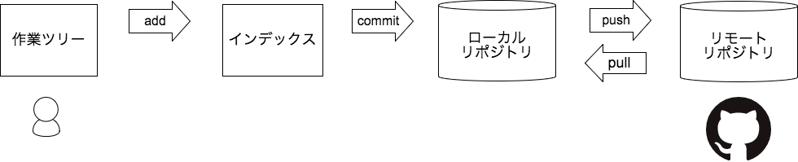

# Git ハンズオン

実際に Git コマンドを操作することで、 Git に慣れてスムーズにチーム開発に入れることを目標にします。

## Git イメージ図



## GitHub のアカウントを作成する

https://github.com

## Git のインストール・設定

### Mac

Mac には標準で Git がインストールされているはず。
Homebrew で最新版を入れたければ、以下などを参照。

- [HomebrewでGitをインストールする \- Qiita](https://qiita.com/micheleno13/items/133aee005ae37c28960e)
- [HomebrewでGitをインストールする \- 1\.21 jigowatts](http://sh-yoshida.hatenablog.com/entry/2017/02/11/213323)

### Windows

今回は、 Git for Windows を使用する。

[Git for Windows](https://git-for-windows.github.io/) からダウンロードしてインストールする。

### ユーザー名、メールアドレスを設定する

ユーザー名、メールアドレスは GitHub のアカウントに合わせる。

```
git config --global user.name "y-kida11"
git config --global user.email "y.kida@gingerapp.co.jp"
```

以下で確認する

```
git config --list
```

## Pull Request (PR) の流れ

**ここからハンズオン開始！！**

### リポジトリをクローンする

好きなディレクトリに移動して、以下を実行する

```
git clone git@github.com:gatjp/git_hands_on.git
```

### ブランチを切る

```
cd git_hands_on/
git checkout -b "y-kida-pr"
```

### ファイルを修正する

なんでも良いので、 `fixme.md` に1行追加する。

fixme.md

```
# このファイルを編集してみましょう

hogehoge
```

### 状態を確認する

```
$ git status
On branch y-kida-pr
Changes not staged for commit:
  (use "git add <file>..." to update what will be committed)
  (use "git checkout -- <file>..." to discard changes in working directory)

	modified:   fixme.md
```

### 差分を確認する

```
$ git diff
diff --git a/fixme.md b/fixme.md
index 78085de..da6f413 100644
--- a/fixme.md
+++ b/fixme.md
@@ -1 +1,3 @@
 # このファイルを編集してみましょう
+
+hogehoge
```

### 変更したファイルをインデックスに追加する

```
git add fixme.md
```

全ての変更ファイルを追加することもできます。

```
git add .
```

### インデックスに追加したファイルをコミットする

コミットメッセージは、無理に英語で書く必要はないが、海外のOSSにコミットしたりする場合も考えると、
普段から英語で書くのも良いかもしれない。

```
git commit -m "fixme.md に一行追加"
```

vim が操作できるのであれば、以下でも良い

```
git commit
```

### コミット履歴を確認する

```
git log
```

### リモートリポジトリにブランチを作成する（変更を反映する）

```
git push origin y-kida-pr
```

### GitHub で PR を立てる

実際に立ててみる。

### コメントをもらったら修正する

他の人にコメントをもらって、それに沿って修正してみる。

### approve してもらったらマージする

今回は、実際にはマージしない。

### マージされたら、ブランチを削除する

```
git checkout master
git checkout -D y-kida-pr
```

リモートの master ブランチの変更を取り込む

```
git pull
```

リモートの変更分を取り込まずに確認だけしたい場合

```
git fetch
git status
```

## 過去のコミットを修正する

### 直前のコミットのコミットメッセージを修正する

```
git commit --amend
```

コミットメッセージを修正して、保存する

### 直前のコミットのコミット前に戻る

```
git reset --soft HEAD~
```

### 直前のコミットを取り消す

```
git reset --hard HEAD~
```

### 2つ以上前のコミットを修正する

```
git rebase -i <コミットID>
```

<コミットID> には、修正したいコミットの一つ前のコミットIDを指定する。

### リモートリポジトリにプッシュ済みのコミットを修正した場合

```
git push origin y-kida-pr --force-with-lease
```

リモートリポジトリとローカルリポジトリの履歴に違いがないか確認してくれる、的な感じらしい。

`--force` だと、単純に上書きしてしまうので、 `--force-with-lease` を使う。

## コンフリクトの解消

master に向けた PR でコンフリクトが発生した場合

```
git pull --rebase origin master
```

コンフリクトを解消したら

```
git add <ファイル名>
git rebase --continue
git push origin <ブランチ名> --force-with-lease
```

## Git コマンドの補完

[【2ステップ】Gitコマンドでtab補完を有効にする \- Qiita](https://qiita.com/growsic/items/1fff6286061e0cd27d54)
